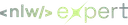

<div align="center" id="top"> 
  
</div>

<h1 align="center">Rocketseat NLW Expert – Node.js</h1>

<p align="center">
  

  

  
</p>

<p align="center">
  <a href="#dart-about">About</a> &#xa0; | &#xa0; 
  <a href="#sparkles-features">Features</a> &#xa0; | &#xa0;
  <a href="#rocket-technologies">Technologies</a> &#xa0; | &#xa0;
  <a href="#white_check_mark-requirements">Requirements</a> &#xa0; | &#xa0;
  <a href="#checkered_flag-starting">Starting</a> &#xa0; | &#xa0;
  <a href="https://github.com/oliveiralecca" target="_blank">Author</a>
</p>

<br>

## :dart: About ##

This project was developed on the 14th edition of Rocketseat's famous event called Next Level Week. On this back-end trail, an API to register votes on polls was built.

## :sparkles: Features ##

:heavy_check_mark: &nbsp;Create a new poll;\
:heavy_check_mark: &nbsp;Get information about a poll;\
:heavy_check_mark: &nbsp;Vote on a poll;\
:heavy_check_mark: &nbsp;Receive the number of votes in realtime.

## :rocket: Technologies ##

The following tools were used in this project:

- [Node.js](https://nodejs.org/en)
- [Fastify](https://fastify.dev/)
- [Prisma](https://www.prisma.io/)
- [PostgreSQL](https://www.postgresql.org/)
- [Redis](https://redis.io/)
- [Zod](https://zod.dev/)
- [Docker](https://www.docker.com/)

## :white_check_mark: Requirements ##

Before starting :checkered_flag:, you need to have [Git](https://git-scm.com) and [Node](https://nodejs.org/en/) installed.

## :checkered_flag: Starting ##

```bash
# Clone this project
$ git clone https://github.com/oliveiralecca/rocketseat-nlw-expert-nodejs

# Access
$ cd rocketseat-nlw-expert-nodejs

# Run the docker containers
# You need to install docker desktop on your machine

# Install dependencies
$ yarn or npm i

# Create the tables on your database
$ npx prisma migrate dev

# Run the project
$ yarn dev or npm run dev

# The server will initialize in the <http://localhost:3333>
# You will need your own DATABASE_URL env variable
```

&#xa0;

Made with 💕 by <a href="https://github.com/oliveiralecca" target="_blank">Letícia Oliveira</a>

&#xa0;

<a href="#top">Back to top :top:</a>
